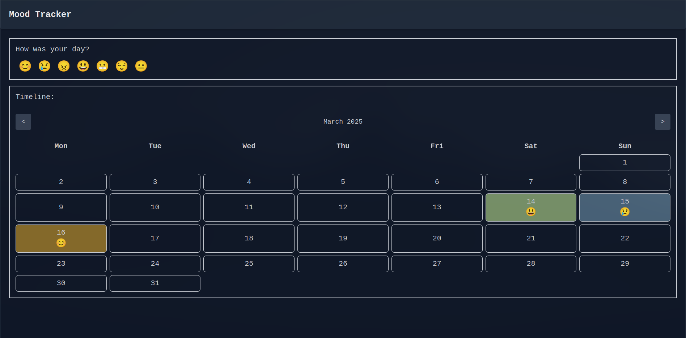
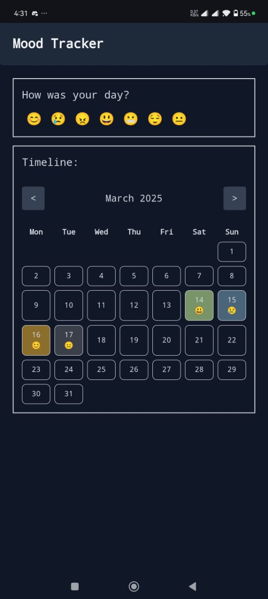

# Mood Tracker

This application allows you to log your mood each day and visualize your emotional trends.

## Features

- Pick an emoji to represent your mood for the day.
- Store mood-related data for each day in local storage.
- View your mood for each day in a calendar view.

## Screenshots

- 
- 

## Deployment

Access the application [here](https://kartik-dhawan-dev.github.io/mood-tracker/).

## Testing

To test, add a stringified JSON in the following format to the `MOOD_STATE` key in local storage:

```json
[
    { "date": "2025-03-17", "mood": "happy" },
    { "date": "2025-03-18", "mood": "sad" }
]
```

## Supported Moods
```
- happy
- sad
- angry
- excited
- nervous
- relaxed
- bored
```
